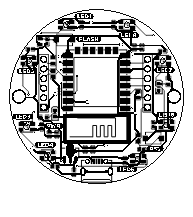
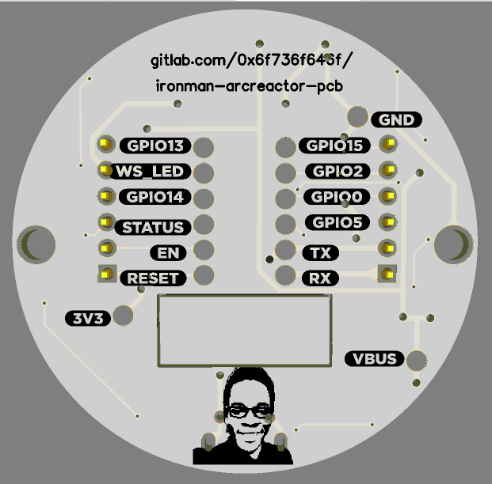
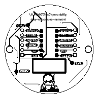

# Ironman Arc Reactor PCB

This repository attempts to design an Ironman Arc Reactor PCB, a method that uses LEDs to light up the 3D printed reactor.

## Description

We try and build the iron man arc reactor by a PCB with LED's. A 3D printed case above the LED's will be able to show the idea of the reactor yet it will not be an actual reactor.

## Visuals

Check out the 

## Installation

Make sure you have EasyEda or you can use the online version to check out this files

## Support

For support contact me via mail or twitter

## Roadmap

We hope to launch a line so that we could give people on Halloween

## Contributing

Check out the [Contribution guide](./CONTRIBUTING.md)

## Authors and acknowledgment

- Michael Kimani
- Felix Wanyoike
- Washington Kamadi

## License

Check out [LICENSE](./LICENSE)

## Project status

